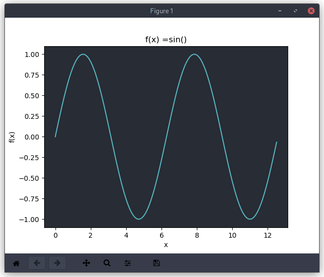
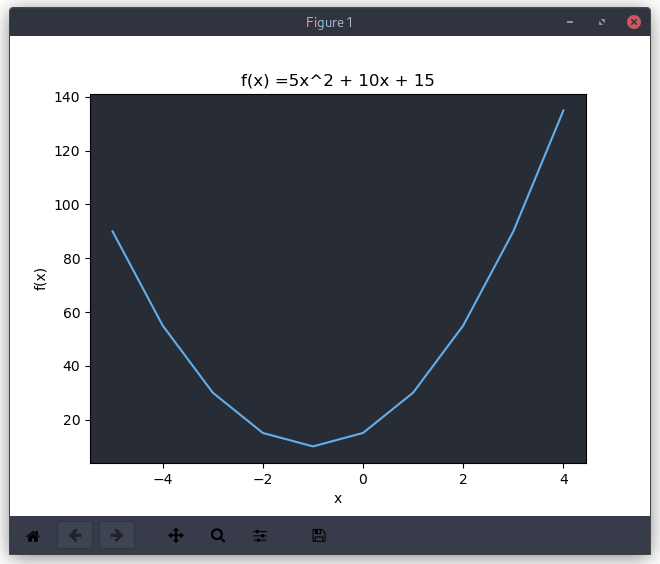
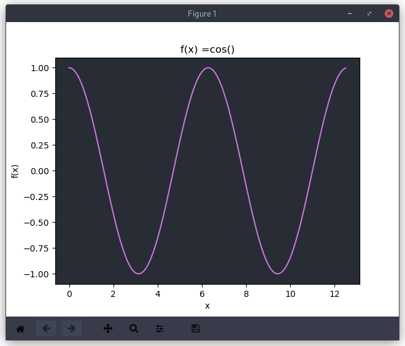
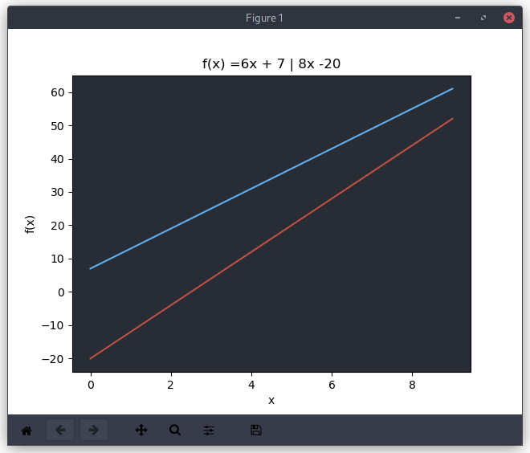

# Graph-man

Readme file for the source. Usage instructions and feature list.

## Dependencies

- Python3.x
- Matplotlib
- numpy
- git (optional)

## Install

Please install Python from https://python.org on windows or from your distributions' Package manager on Linux and make sure Python and its scripts(pip3 etc) are in PATH.

After that please install required componenets:
```sh
$ pip install matplotlib numpy
```

If you are on windows, Please type above command in `cmd` or `PowerShell` whichever you prefer.

Make sure you have an active internet connection.

## Without Git

If you don't know what Git is or do not know how to use it. Then please click on `Code` button on github and `Download Zip`

Then you can open `cmd` or terminal in the extracted directory

- cd into source dir: `cd src`
- Run with Python: `python graphs.py`

## With Git

```sh
$ git clone https://github.com/icebarf/graph-man

# if you prefer ssh
$ git clone ssh://git@github.com/icebarf/graph-man

$ cd graph-man

$ cd src

# Run with python
$ python graphs.py
```

## Usage

This sections contains different usage instructions and some examples.

### Input

Input is given in the following form for different equations and functions. Please look at examples section of [Graphing.](./README.md#Graphing)

General form:
- ax^2 + bx + c
- bx + c
- trig()

where `a`,`b`,`c` are integers and `trig` is a trigonometric function.

Type `help` in the `Input:` prompt for more information.

### Graphing

Graph-man supports the following types to be plotted:

- Quadratic Equations
- Linear Equations
- Trigonometric Functions

You can input multiple equations of the same type or single equations to plot.

Note that multiple equations **are required to be spearated with a pipe symbol - `|`**

You cannot plot multiple trigonometric functions at once.

Examples:
```sh
$ python graphs.py

# quadratics
> Input: 5x^2 - 2x + 4
> Input: 7x^2 + 5x - 4 | 8x^2 + 24x - 2

# linears
> Input: 6x + 7
> Input: 12x + 3 | 53x + 3

# trigonometric functions
> Input: sin()
> Input: cos()
> Input: tan()
> Input: cosec()
> Input: sec()
> Input: cot()
```

### Configuration

You can configure the different variable with which the graphs are generated.

- `scale`: maximum value of x (stop)
- `base` : minimum value of x (start)
- `gap`  : gap between the base and next value or the `jump` value.

All of these variables are configured at runtime and can be changed in the source file or in the `Input:` prompt.

They take integers as the values.

Examples:
```sh
> Input: scale = 5
> Input: base = -5
> Input: gap = 1
```

# Showcase

- `Input: sin()`



- `Input: scale=5`
- `Input: base=-5`
- `Input: 5x^2 + 10x + 15`



- `Input: cos()`



- `Input: 6x + 7 | 8x -20`

